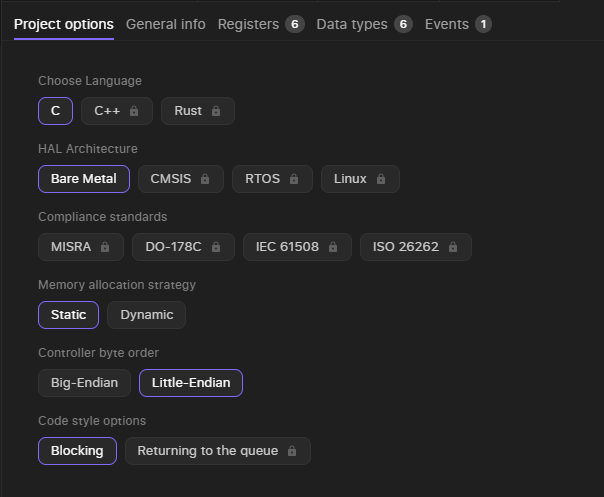
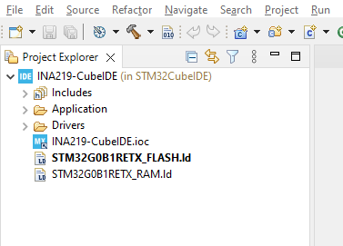
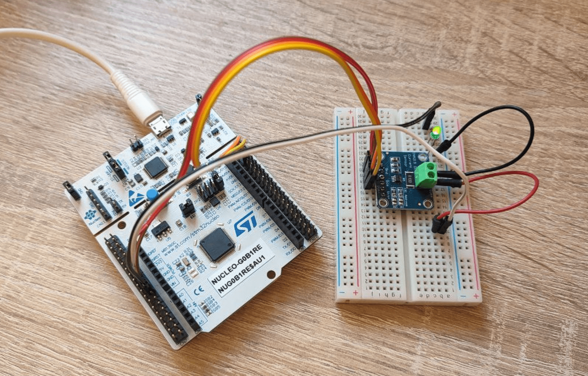

# Integrating Embedd driver to STM32

Author: Oleksii Babenko


## Intro

Ready to simplify your embedded development workflow? In this guide, we'll demonstrate how to effortlessly create a custom driver for the INA219 current and power monitor using our Embedd driver generation tool.  Then, we'll integrate the driver into a project on the NUCLEO-G0B1RE development board.

## **What You'll Need**

- Hardware
    - [NUCLEO-G0B1RE](https://www.st.com/en/evaluation-tools/nucleo-g0b1re.html) - the target board
    - [INA219](https://www.ti.com/lit/ds/symlink/ina219.pdf?ts=1722403095948) - the current sensor board
- Software
    - [STM32CubeMX](https://www.st.com/en/development-tools/stm32cubemx.html) - to generate the project with all the STM32 related libraries and initialized MCU’s peripheral
    - [STM32CubeIDE](https://www.st.com/en/development-tools/stm32cubeide.html) - to work on the code and build the project

## Generate Your driver

Let's kick things off by generating an INA219 driver:

1. **Access the Embedd Platform:**  Go to our driver generation platform at [https://platform.embedd.it/](https://platform.embedd.it/).
2. **Upload the Datasheet:** Upload your INA219 datasheet (in PDF format) to the platform. Our system will automatically extract the essential parameters and specifications.
3. **Configure Your Driver:**
    - Select "INA219" from the component list
    - A configuration panel will appear. Here's where you can customize the driver to your exact requirements. Take a look at the screenshot below for a recommended starting point:
        
        
        
4. **Download Your Driver:** Once you've finalized your configurations, simply click the "Generate Driver" button. Your custom INA219 driver will be available for download: ****
    
    
    

## Generate a project using STM32CubeMX( for STM32CubeIDE )

While a full tutorial on STM32CubeMX is beyond the scope of this guide, we'll focus on a crucial step for seamless integration with the INA219 sensor.

1. **Create Your Project:** Open STM32CubeMX and create a new project for your NUCLEO-G0B1RE board.
2. **Pinout Configuration:**
    - In the "Pinout & Configuration" tab, locate the "System Core" section.
    - Expand the "I2C1" peripheral. Notice that by default, the SDA and SCL pins are assigned to PA10 and PA9, respectively.
    - To use the more convenient Arduino header pins, we need to remap I2C1:
        
        
        
        - Click on the "PB9" (SDA) pin and select "I2C1_SDA" from the dropdown menu.
        - Click on the "PB8" (SCL) pin and select "I2C1_SCL" from the dropdown menu
3. **Toolchain/IDE:**
    - In the “Project Manager” tab locate the “Toolchain/IDE” option and choose the “STM32CubeIDE” from the dropdown menu.
4. **Generate Code:** Click "Generate Code" to create your STM32CubeIDE project with the necessary initialization and configuration.

## Add the driver to the build system

1. **Locate Your Project:** Open your newly generated STM32CubeIDE project. You'll see a basic project structure similar to this:
    
    
    
2. **Organize Your Driver Files:** To keep things organized, create a new folder named `ina219` within `Drivers` directory.
3. **Extract and Copy:** Extract the contents of the downloaded INA219 driver archive (`.zip`) into the `Drivers/ina219` folder. Your project structure should now look like this:
    
    
    
4. **Inform the Compiler:** We need to tell STM32CubeIDE where to find the driver's header files:
    - Go to `Project > Properties`.
    - In the left panel, navigate to `C/C++ General > Paths and Symbols`.
    - Under the "Includes" tab:
        - Click "Add..."
        - Choose "Workspace..." and browse to the `Drivers/ina219` folder.
        - Click "OK" to add this path.
            
            
            
5. **Include the Header:** Now that the compiler knows where to look, open the `Application/User/Core/main.c` file and include the driver's header file within the designated user code section:
    
    ```c
    /* Includes ------------------------------------------------------------------*/
    #include "main.h"
    
    /* Private includes ----------------------------------------------------------*/
    /* USER CODE BEGIN Includes */
    #include "ina219.h"
    /* USER CODE END Includes */
    ```
    

**Please note:**

- **User Code Sections:** Using the `/* USER CODE BEGIN */` and `/* USER CODE END */` markers is crucial. These sections are preserved when you regenerate project files with STM32CubeMX, ensuring your custom code isn't overwritten.

## Preparing the device object

Now that the Embedd-generated driver is integrated into your project, let's create the necessary objects to interact with your INA219 sensor.

1. **Create the Device Object:** The Embedd driver provides a convenient macro to instantiate an INA219 device object. Add this line within the  `/* USER CODE BEGIN PM */` and  `/* USER CODE END PM */` section in your `main.c` file:
    
    ```c
    INA219_I2C_DEVICE_DEFINE(current_sensor, "INA219")
    ```
    
    This does two things:
    
    - It creates a `current_sensor` object that represents your INA219 device.
    - It automatically sets up the internal data structures needed for communication with the sensor.
2. **Declare Bus Functions:** In the `/* USER CODE BEGIN PFP */` and `/* USER CODE END PFP */` section, declare the prototypes for the functions that will handle the I2C communication:
    
    ```c
    static EMBEDD_RESULT ina219_bus_write(const struct embedd_device_t* dev, const uint8_t* data_ptr, uint32_t data_size);
    static EMBEDD_RESULT ina219_bus_read(const struct embedd_device_t* dev, uint8_t* data_ptr, uint32_t data_size);
    ```
    
3. **Create the Bus Object:** Now that you have declared the functions to handle I2C communication, let's create the `ina219_bus` object. This object will bundle the read and write functions together and make them accessible to the INA219 device object. Inside the  `/* USER CODE BEGIN 0 */` and  `/* USER CODE END 0 */` section, initialize the `ina219_bus` object:
    
    ```c
    static const embedd_bus_t ina219_bus = {
        .write = ina219_bus_write, 
        .read = ina219_bus_read 
    };
    ```
    
4. **Implement Bus Functions:** The Embedd driver needs to know how to communicate with the I2C peripheral on your microcontroller. In the `/* USER CODE BEGIN 4 */` and `/* USER CODE END 4 */` section, implement the following functions using the STM32 HAL library:
    - **`ina219_bus_write`:** This function is responsible for writing data to the INA219 sensor over the I2C bus.
        
        ```c
        EMBEDD_RESULT ina219_bus_write(const struct embedd_device_t* dev, const uint8_t* data_ptr, uint32_t data_size)
        {
          if( ( dev == NULL ) || ( data_ptr == NULL ) )
          {
            return EMBEDD_RESULT_ERR;
          }
        
          //Extracting I2C configurations from the device object
          embedd_i2c_dev_cfg_t* dev_cfg = embedd_i2c_get_dev_config( dev );
          if( dev_cfg == NULL )
          {
              return EMBEDD_RESULT_ERR;
          }
        
          //Writing data to the bus
          HAL_StatusTypeDef status = HAL_I2C_Master_Transmit(&hi2c1, (dev_cfg->addr << 1), (uint8_t*)data_ptr, data_size, 100 );
          if( status != HAL_OK)
          {
              return EMBEDD_RESULT_ERR;
          }
        
          return EMBEDD_RESULT_OK;
        }
        ```
        
    - **`ina219_bus_read`:** This function reads data from the INA219 sensor over the I2C bus.
        
        ```c
        EMBEDD_RESULT ina219_bus_read(const struct embedd_device_t* dev, uint8_t* data_ptr, uint32_t data_size)
        {
          if( ( dev == NULL ) || ( data_ptr == NULL ) )
          {
              return EMBEDD_RESULT_ERR;
          }
        
          //Extracting I2C configurations from the device object
          embedd_i2c_dev_cfg_t* dev_cfg = embedd_i2c_get_dev_config( dev );
          if( dev_cfg == NULL ){
              return EMBEDD_RESULT_ERR;
          }
        
          //Reading data from the bus
          HAL_StatusTypeDef status = HAL_I2C_Master_Receive(&hi2c1, (dev_cfg->addr << 1), data_ptr, data_size, 100 );
          if( status != HAL_OK)
          {
              return EMBEDD_RESULT_ERR;
          }
        
          return EMBEDD_RESULT_OK;
        }
        ```
        
5. **Implement the Delay Function:** Finally, implement the `embedd_hal_sleep` function declared within `Drivers/ina219/embedd_hal.h` file to provide a delay mechanism. This function is used within the driver for timing-sensitive operations. You can use the `HAL_Delay` function and implement it within the `/* USER CODE BEGIN 4 */` and `/* USER CODE END 4 */` as well.
    
    ```c
    void embedd_hal_sleep( uint32_t mseconds )
    {
        HAL_Delay(mseconds);
    }
    ```
    

## Device’s initialization

Now that you have your device object and bus object ready, let's initialize the INA219 sensor for communication.

1. **Define the I2C Address:** The I2C address is used to identify your INA219 sensor on the bus. The INA219 sensor board has a default I2C address of `0x40`. Define this address as a constant in your code. In the `/* USER CODE BEGIN PD */` and `/* USER CODE END PD */` section of your `main.c` file, add:
    
    ```c
    #define INA219_I2C_DEV_ADDR 0x40
    ```
    
2. Inside the `/* USER CODE BEGIN 2 */` and `/* USER CODE END 2 */` section, perform the following initialization steps:
    - **Assign the Bus:** This step tells the `current_sensor` object how to communicate (i.e., which functions to use for reading and writing) over the I2C bus. Link the `current_sensor` device object to the `ina219_bus` object you created earlier:
        
        ```c
        current_sensor.bus = &ina219_bus;
        ```
        
    - **Configure I2C Settings:** Set the I2C device configuration to use the defined address;
        
        ```c
        embedd_i2c_dev_cfg_t current_sensor_cfg = {.addr = INA219_I2C_DEV_ADDR};
        embedd_i2c_set_dev_config( &current_sensor, &current_sensor_cfg );
        ```
        

## Verify Your Driver's Operation

Let's write a simple test code to confirm that your INA219 driver is working correctly.

1. **Read Registers (Test Loop)**: In the `/* USER CODE BEGIN WHILE */` and `/* USER CODE END WHILE */` section of your `main.c` file's `while(1)` loop, add the following code:
    
    ```c
    // Variables to store register values
    uint16_t config_reg        = 0;
    uint16_t shunt_voltage_reg = 0;
    uint16_t bus_voltage_reg   = 0;
    uint16_t power_reg         = 0;
    uint16_t current_reg       = 0;
    uint16_t calibration_reg   = 0;
    
    // Read all registers
    if (INA219_READ_REG( current_sensor, ina219_configuration, config_reg )        == EMBEDD_RESULT_OK &&
        INA219_READ_REG( current_sensor, ina219_shunt_voltage, shunt_voltage_reg ) == EMBEDD_RESULT_OK &&
        INA219_READ_REG( current_sensor, ina219_bus_voltage,   bus_voltage_reg )   == EMBEDD_RESULT_OK &&
        INA219_READ_REG( current_sensor, ina219_power,         power_reg )         == EMBEDD_RESULT_OK &&
        INA219_READ_REG( current_sensor, ina219_current,       current_reg )       == EMBEDD_RESULT_OK &&
        INA219_READ_REG( current_sensor, ina219_calibration,   calibration_reg )   == EMBEDD_RESULT_OK)
    {
      /* USER CODE BEGIN IN CASE OF SUCCESS */
      debug("Register map:\r\n");
      debug("  CONFIGURATION     - 0x%04X\r\n", config_reg);
      debug("  SHUNT_VOLTAGE     - 0x%04X\r\n", shunt_voltage_reg);
      debug("  BUS_VOLTAGE       - 0x%04X\r\n", bus_voltage_reg);
      debug("  POWER             - 0x%04X\r\n", power_reg);
      debug("  CURRENT           - 0x%04X\r\n", current_reg);
      debug("  CALIBRATION       - 0x%04X\r\n", calibration_reg);
      /* USER CODE END IN CASE OF SUCCESS */
    }
    else
    {
      /* USER CODE BEGIN IN CASE OF ERROR */
      debug("Registers reading error!\r\n");
      /* USER CODE END IN CASE OF ERROR */
    }
    HAL_Delay(5000); // Wait 5 seconds before reading again
    ```
    
    **Explanation:**
    
    1. **Variables:** The code declares variables to hold the values read from each INA219 register.
    2. **Register Reads:** It uses the `INA219_READ_REG` macro (provided by the Embedd driver) to read each register.
    3. **Success/Error Handling:**
        - If all reads are successful (return `EMBEDD_RESULT_OK`), you can access the register values in the `config_reg`, `shunt_voltage_reg`, etc. variables.
        - If any read fails, the `else` block is executed.
2. **Debug Output (UART):** This function allows us to see the registers content or an error during the test loop. This function uses the UART2 which is initialized by default(115200, N, 1) by STM32CubeMX and available via STLink micro USB connector. It requires:
    - Place a buffer within `/* USER CODE BEGIN PV */` and `/* USER CODE END PV */`  section
        
        ```c
        uint8_t debug_buf[100];
        ```
        
    - Define the function in the `/* USER CODE BEGIN PFP */` and `/* USER CODE END PFP */`  section
        
        ```c
        static void debug(const char *format, ...) __attribute__ ((format (printf, 1, 2)));
        ```
        
    - Implement the function in the `/* USER CODE BEGIN 4 */` and `/* USER CODE END 4 */` section
        
        ```c
        void debug(const char *format, ...)
        {
            va_list args;
        
            va_start(args, format);
            uint16_t debug_msg_size = vsnprintf((char *)debug_buf, sizeof debug_buf, format, args);
            va_end(args);
        
            HAL_UART_Transmit(&huart2, debug_buf, debug_msg_size, 100);
        }
        ```
        
3. **Build and Run:** 
    - **Build Project:** In STM32CubeIDE, click `Project > Build Project` to compile your code.
    - **Flash to Board:** Connect your NUCLEO-G0B1RE to your computer and flash the compiled code onto it. Here is how our HW setup looks like:
        
        
        
    - **Observe Output:** Monitor the console output to see the register values from the INA219 sensor. We got the following output:
        
        ```powershell
        Register map:
          CONFIGURATION     - 0x399F
          SHUNT_VOLTAGE     - 0x0060
          BUS_VOLTAGE       - 0x27D2
          POWER             - 0x0000
          CURRENT           - 0x0000
          CALIBRATION       - 0x0000
        Register map:
          CONFIGURATION     - 0x399F
          SHUNT_VOLTAGE     - 0x0060
          BUS_VOLTAGE       - 0x27CA
          POWER             - 0x0000
          CURRENT           - 0x0000
          CALIBRATION       - 0x0000
        Register map:
          CONFIGURATION     - 0x399F
          SHUNT_VOLTAGE     - 0x0061
          BUS_VOLTAGE       - 0x27CA
          POWER             - 0x0000
          CURRENT           - 0x0000
          CALIBRATION       - 0x0000
        Register map:
          CONFIGURATION     - 0x399F
          SHUNT_VOLTAGE     - 0x0061
          BUS_VOLTAGE       - 0x27DA
          POWER             - 0x0000
          CURRENT           - 0x0000
          CALIBRATION       - 0x0000
        ```
        
        The `CONFIGURATION` register’s default value is 0x399F and it is what we can observe from the printed register map. The `SHUNT_VOLTAGE` and `BUS_VOLTAGE` registers’ value change a little bit because of internal ADC noise. The other two registers `POWER` and `CURRENT`  contain 0x0000 value because the `CALIBRATION` register is not written yet.
        

## Conclusion

Congratulations! You've successfully integrated a custom INA219 driver into your STM32 project, leveraging the Embedd platform for streamlined driver creation. Your test code demonstrates a correctly functioning driver by consistently reading and outputting register values.

**What You've Accomplished:**

- **Effortless Driver Generation:** The Embedd platform's intuitive interface allowed you to quickly generate a tailored driver for the INA219 sensor, eliminating the need to manually write low-level register access code.
- **Seamless Integration:** You've successfully incorporated the generated driver into your STM32CubeIDE project, utilizing the STM32 HAL library for efficient I2C communication.
- **Operational Verification:** By reading and logging the INA219's register values, you've confirmed the driver's ability to communicate with the sensor and retrieve data.


💡 Go ahead and try generating your own driver using Embedd Platform. Head to [platform.embedd.it](http://platform.embedd.it) to start your project.

